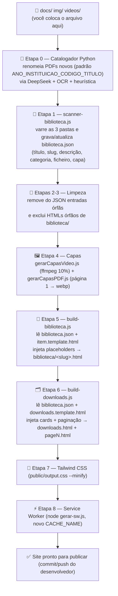
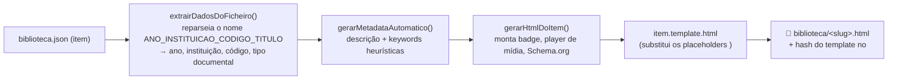
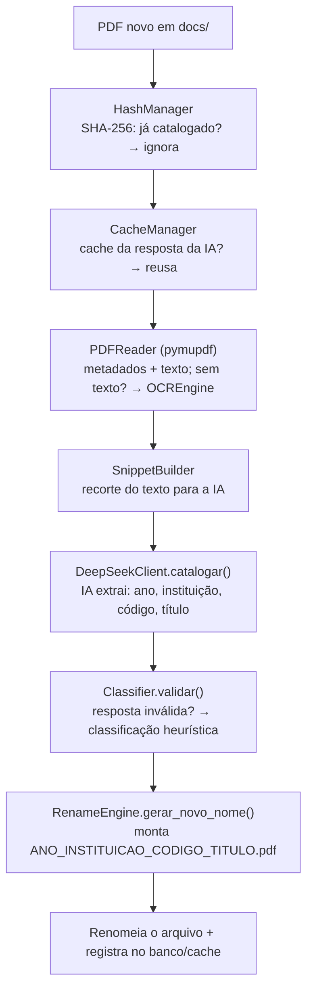

# 📚 Catálogo da Biblioteca de Enfermagem

**Projeto:** Calculadoras de Enfermagem
**Gerado em:** 28/08/2026
**Escopo:** Documentação completa do sistema que gera a Biblioteca de Enfermagem (documentos, fotos e vídeos → `biblioteca.json` → páginas HTML)

---

## 1. Visão Geral

A Biblioteca de Enfermagem é o acervo digital do site: **documentos (PDF), fotos/imagens e vídeos** de
enfermagem disponíveis para download e consulta. Ela é **100% gerada por scripts** — você **não escreve HTML**:
basta colocar o arquivo na pasta correta (`docs/`, `img/` ou `videos/`) e rodar o pipeline no terminal.

| Pergunta | Resposta |
|---|---|
| Onde coloco o arquivo? | `docs/` (PDF), `img/` (imagens) ou `videos/` (MP4/WebM) |
| O que cataloga os arquivos? | `automacoes/catalogador/` (Python + IA DeepSeek, só para PDFs) |
| O que varre as pastas? | `scanner-biblioteca.js` → grava em `biblioteca.json` |
| Onde saem as páginas de cada item? | `biblioteca/<slug>.html` (NUNCA editar manualmente) |
| Onde saem as páginas de listagem? | `downloads/` — `downloads.html` + `page2.html`... (NUNCA editar manualmente) |
| Quais templates são usados? | `item.template.html` (item) e `downloads.template.html` (listagem) |
| Qual a URL da biblioteca? | `https://www.calculadorasdeenfermagem.com.br/downloads.html` |
| Qual a URL de um item? | `https://www.calculadorasdeenfermagem.com.br/biblioteca/<slug>.html` |
| Quem orquestra tudo? | `biblioteca-automation.js` (`node biblioteca-automation.js`) |

> ⚠️ **Regra de ouro:** `downloads/` e `biblioteca/` são pastas **GERADAS e PROIBIDAS** de alterar
> manualmente (estão na lista de proibições do projeto, junto com `downloads.html`). Qualquer edição
> feita nelas é **sobrescrita no próximo build**. A fonte de verdade são os arquivos físicos em
> `docs/`, `img/`, `videos/` e o `biblioteca.json`. Mudanças de layout devem ser feitas nos templates
> (`item.template.html`, `downloads.template.html`) ou nos scripts do pipeline — sempre com autorização.

---

## 2. Estrutura Física (pastas e arquivos do sistema)

```
raiz-do-site/
├── docs/                                  ← FONTE (documentos: PDF, CSV, TXT...)
│   └── 1956_Faculdade_de_Higiene_..._Glossario_de_Epidemiologia.pdf
├── img/                                   ← FONTE (fotos do site + capas geradas)
│   └── <nome>.webp  (inclui capas <base>.webp dos PDFs e vídeos)
├── videos/                                ← FONTE (vídeos .mp4 / .webm)
│   └── <nome>.mp4
├── automacoes/catalogador/                ← CATALOGADOR Python (renomeia PDFs novos)
│   ├── main.py          ← ponto de entrada (--once / --watch / --stats / --reprocess)
│   ├── database.py      ← SQLite catalogador.db (histórico)
│   ├── hash_manager.py  ← SHA-256 (não reprocessa arquivo já catalogado)
│   ├── cache_manager.py ← cache das respostas da IA
│   ├── pdf_reader.py    ← leitura do PDF (pymupdf)
│   ├── ocr_engine.py    ← OCR quando o PDF não tem texto
│   ├── snippet_builder.py
│   ├── deepseek_client.py ← chama a IA DeepSeek
│   ├── classifier.py    ← valida a resposta da IA (fallback heurístico)
│   ├── rename_engine.py ← gera o nome final ANO_INSTITUICAO_CODIGO_TITULO.pdf
│   └── output_generator.py
├── biblioteca.json                        ← BASE DE DADOS (fonte de verdade dos metadados)
├── scanner-biblioteca.js                  ← varre docs/ img/ videos/ → biblioteca.json
├── gerarCapasVideo.js                     ← capas de vídeo (ffmpeg, frame a 10%)
├── gerarCapasPDF.js                       ← capas de PDF (pdf-poppler/pdf2pic + sharp)
├── build-biblioteca.js                    ← gera biblioteca/<slug>.html (via item.template.html)
├── build-downloads.js                     ← gera downloads.html + pageN.html (via downloads.template.html)
├── item.template.html                     ← TEMPLATE de cada item (placeholders <!-- ... -->)
├── downloads.template.html                ← TEMPLATE da listagem (placeholders <!-- ... -->)
├── biblioteca-automation.js               ← ORQUESTRADOR (roda as 9 etapas em sequência)
├── biblioteca/                            ← SAÍDA GERADA (1 HTML por item — proibido editar)
│   └── <slug>.html  (1.361 páginas)
├── downloads/                             ← SAÍDA GERADA (listagem paginada — proibido editar)
│   ├── downloads.html                     ← página 1
│   └── page2.html ... page6.html          ← demais páginas
└── (build geral do site: tailwindcss + node gerar-sw.js)
```

**Números atuais do acervo (levantados em 28/08/2026):**

| Medida | Valor |
|---|---|
| Itens em `biblioteca.json` | **1.361** |
| Fotos (`categoria: fotos`) | 1.321 |
| Vídeos (`categoria: videos`) | 15 |
| Documentos (`categoria: documentos`) | 25 |
| PDFs físicos em `docs/` | 21 (+ 1 CSV, 1 JSON, 1 TXT) |
| Vídeos físicos em `videos/` | 15 (.mp4) |
| Imagens em `img/` | 1.323 |
| HTMLs gerados em `biblioteca/` | 1.361 |
| Itens por página em `downloads/` | **250** → 6 páginas ativas |

---

## 3. Fluxograma do Sistema



Fluxo de um item dentro do `build-biblioteca.js`:



---

## 4. As Três Pastas de Origem (docs/, img/, videos/)

O `scanner-biblioteca.js` monitora **exatamente três pastas** e converte cada pasta em uma **categoria**
fixa dentro do `biblioteca.json`:

| Pasta | Categoria no JSON | Conteúdo esperado | Capa |
|---|---|---|---|
| `docs/` | `documentos` | PDF, CSV, TXT, JSON... | gerada da 1ª página do PDF (ou vazia) |
| `img/` | `fotos` | imagens (.webp, .png, .jpg...) | o próprio ficheiro |
| `videos/` | `videos` | .mp4 / .webm | frame do vídeo (ffmpeg, 10% da duração) |

- O caminho gravado no JSON é sempre absoluto a partir da raiz: `/docs/nome.pdf`, `/img/nome.webp`,
  `/videos/nome.mp4` (campo `ficheiro`).
- **Tudo** o que estiver dentro dessas pastas vira item da biblioteca — inclusive CSV/JSON/TXT que
  estejam em `docs/` (por isso a categoria `documentos` tem 25 itens com 21 PDFs físicos).

---

## 5. Como Renomear os Arquivos (padrão obrigatório para PDFs)

### 5.1 Fotos e vídeos

Não há renomeador automático. O nome do arquivo vira o **título exibido**: o scanner remove a extensão,
troca `-` e `_` por espaço e capitaliza cada palavra.

- Ex.: `braden-calculadoras-de-enfermagem.webp` → título "Braden Calculadoras De Enfermagem".
- Ou seja: **escolha nomes legíveis** porque eles aparecem ao usuário e viram o `slug` da URL.
- O título pode depois ser **refinado manualmente** direto no `biblioteca.json` (ex.: um item cujo
  ficheiro é `metasinternacionais-calculadoras-de-enfermagem.webp` tem título
  "Metas Internacionais de Segurança do Paciente").
- O `slug` é gerado automaticamente: minúsculas, sem acentos, sem caracteres especiais, palavras
  separadas por hífen (`braden-calculadoras-de-enfermagem`).
- Duplicatas são resolvidas automaticamente com sufixo numérico (`-2`, `-3`...).

### 5.2 PDFs — Catalogador Inteligente (padrão `ANO_INSTITUICAO_CODIGO_TITULO.pdf`)

PDFs novos em `docs/` são renomeados pelo **Catalogador Inteligente** (Python), que lê o conteúdo do
arquivo (texto + OCR) e usa a **IA DeepSeek** para identificar ano, instituição, código e título.
O nome final segue o padrão:

```
ANO_INSTITUICAO_CODIGO_TITULO.pdf
```

Exemplos reais do acervo:

```
1956_Faculdade_de_Higiene_e_Saude_Publica_da_Glossario_de_Epidemiologia.pdf
1990_Camara_dos_Deputados_LEI_No_8.080_DE_19_DE_SETEMBRO_DE_1990.pdf
2000_American_Heart_Association_Part_4_The_Automated_External_Defibrillator.pdf
```

Regras do nome (`rename_engine.py`):

| Regra | Detalhe |
|---|---|
| Sem espaços | substituídos por `_` |
| Sem acentos/cedilha | normalizados |
| Sem aspas, parênteses, colchetes | removidos |
| Sem `_` repetidos | colapsados em um só |
| Caracteres permitidos | apenas letras, números, ponto, hífen e underscore |
| Extensão | `.pdf` sempre preservada |
| Ano desconhecido | vira `XXXX` no início |
| Limite do título | 80 caracteres |
| Limite da instituição | 40 caracteres |
| Limite do código | 20 caracteres |
| Limite do nome total | 200 caracteres |

Código interno (ex.: `POP.DEA.006`, `MA.DENF.001`) fica entre a instituição e o título.

### 5.3 Como o Catalogador decide (fluxo interno, `main.py`)



Modos de execução do catalogador:

```
python -m automacoes.catalogador.main --once        → processa tudo e encerra
python -m automacoes.catalogador.main --watch       → monitoramento contínuo
python -m automacoes.catalogador.main --stats       → só estatísticas
python -m automacoes.catalogador.main --reprocess   → força reprocessamento total
```

> No pipeline `biblioteca-automation.js`, a Etapa 0 executa o catalogador com `--once`
> (timeout de 10 minutos). Se não houver PDF novo, ele apenas encerra.

---

## 6. Como os Itens São Captados para o biblioteca.json (scanner-biblioteca.js)

1. Carrega o `biblioteca.json` existente (array de itens).
2. **Garante slug único** para todos os itens (gera slug se faltar; sufixo `-2`, `-3`... em duplicatas).
3. **Garante descrição** automática se faltar (frase padrão por categoria — ver seção 11).
4. **Garante capa** para fotos (a capa da foto é o próprio ficheiro).
5. Monta um `Set` com os `ficheiro` já existentes (dedupe por caminho).
6. Varre cada uma das 3 pastas; **cada arquivo que ainda não está no JSON vira um item novo**:

```json
{
  "titulo": "Metas Internacionais de Segurança do Paciente",
  "slug": "metas-internacionais-de-seguranca-do-paciente",
  "descricao": "Material de enfermagem sobre ... para apoio educacional e clínico.",
  "keywords": [],
  "meta_descricao": "",
  "categoria": "fotos",
  "ficheiro": "/img/metasinternacionais-calculadoras-de-enfermagem.webp",
  "capa": "/img/metasinternacionais-calculadoras-de-enfermagem.webp"
}
```

7. Salva o JSON e **dispara automaticamente** os motores de capas (vídeos → PDFs).

### 6.1 Schema do item no `biblioteca.json`

| Campo | Tipo | Descrição |
|---|---|---|
| `titulo` | string | Título exibido (derivado do nome do arquivo) |
| `slug` | string | Identificador da URL (`/biblioteca/<slug>.html`) |
| `descricao` | string | Descrição automática exibida na página do item |
| `keywords` | array | Palavras-chave (preenchidas manualmente ou pelo build) |
| `meta_descricao` | string | Meta description manual/IA (prioridade máxima no build) |
| `categoria` | string | `fotos` \| `documentos` \| `videos` |
| `ficheiro` | string | Caminho do arquivo (`/docs/...`, `/img/...`, `/videos/...`) |
| `download` | string | (opcional) Caminho do download, quando diferente de `ficheiro` |
| `capa` | string | Caminho da miniatura (vazio → gerada ou placeholder) |

---

## 7. Criação de Capas para PDFs e Vídeos

### 7.1 Capas de vídeo — `gerarCapasVideo.js`

- Para cada `.mp4` / `.webm` em `videos/` cujo item **não tenha capa**:
  - Usa **ffmpeg** (binário embutido via `ffmpeg-static` + `ffprobe-static`) para capturar
    **1 frame em 10% da duração**;
  - Salva em `img/<nome-do-video>.webp`;
  - Grava `item.capa = "/img/<nome>.webp"` no `biblioteca.json`.
- **Blindagem:** se `item.capa` já existe e não está vazia, o vídeo é pulado (não regera).

### 7.2 Capas de PDF — `gerarCapasPDF.js`

- Para cada `.pdf` em `docs/` sem capa válida:
  1. Converte a **página 1** em PNG com `pdf-poppler` (largura alvo 1024px);
  2. Fallback `pdf2pic` se o poppler falhar;
  3. Redimensiona com **sharp** para 600px de largura e converte para `.webp` (qualidade 80);
  4. Remove o PNG temporário;
  5. Grava `item.capa = "/img/<base>.webp"` no `biblioteca.json`.
- Se já existir uma capa no disco (`<base>.webp` ou variantes com sufixo numérico), ela é
  **associada sem regerar**. Se o JSON aponta para uma capa inexistente, ele tenta reencontrar
  ou gera novamente.
- Só grava no JSON se houve alterações (economia de disco).

---

## 8. Limpeza (Etapas 2-3 do pipeline)

- **Etapa 2 — `biblioteca.json`:** remove entradas cujo arquivo físico (`ficheiro`) não existe mais
  (itens renomeados/apagados não ficam órfãos no JSON).
- **Etapa 3 — `biblioteca/`:** exclui HTMLs individuais que não têm mais item correspondente no JSON.
- Obs.: `build-downloads.js` **não apaga páginas antigas** de `downloads/`. Se o acervo encolher,
  páginas `pageN.html` de builds anteriores podem sobrar como resíduo (hoje existem arquivos até
  `page52.html`, mas só `downloads.html` + `page2.html`–`page6.html` são páginas ativas para os
  1.361 itens ÷ 250 por página).

---

## 9. Transformação em HTMLs Individuais (build-biblioteca.js)

### 9.1 Como funciona

1. Lê `biblioteca.json` e `item.template.html`.
2. Calcula o **SHA-256 do template** e grava um marcador no `<head>` de cada página gerada:
   `<!-- BIBLIOTECA_ITEM_TEMPLATE_HASH:<hash> -->` (rastreabilidade de qual versão do template gerou a página).
3. Para cada item, `extrairDadosDoFicheiro()` **reparseia o nome catalogado**
   (`ANO_INSTITUICAO_CODIGO_TITULO`) e extrai: `ano`, `instituição`, `código`, `título` e
   **tipo documental** — `Resolução`, `Portaria`, `Protocolo`, `Manual`, `Diretriz`,
   `Artigo Científico`, `Prova`, `Código de Ética`, `Parecer Técnico`, `Nota Técnica`,
   `Formulário` ou `Documento` (detecção por palavras do título).
4. Monta **descrição** com prioridade: `meta_descricao` → `descricao` (se > 50 chars) →
   descrição derivada do nome → descrição automática.
5. Monta **keywords**: do JSON + palavras do título/instituição/tipo/ano + base
   `[enfermagem, material de estudo, protocolos, saúde]` (com heurísticas para escala/protocolo/manual).
6. Injeta os placeholders e grava `biblioteca/<slug>.html`. Se o conteúdo gerado for idêntico ao
   atual, o arquivo não é reescrito (contador `criados | atualizados | inalterados`).

### 9.2 O que é injetado em cada página de item

| Placeholder do template | O que o build injeta |
|---|---|
| `<!-- SEO_TITLE -->` | Título do item (title, og:title, twitter:title) |
| `<!-- SEO_DESCRIPTION -->` | Meta description |
| `<!-- SEO_KEYWORDS -->` | Meta keywords |
| `<!-- CANONICAL_URL -->` | `https://www.calculadorasdeenfermagem.com.br/biblioteca/<slug>.html` |
| `<!-- SCHEMA_ORG -->` | JSON-LD `ItemPage` (nome, descrição, url, imagem, publisher) |
| `<!-- [TITLE] -->` | Título no breadcrumb e no H1 |
| `<!-- [DESCRIPTION] -->` | Texto de descrição do arquivo |
| `<!-- [FILE] -->` | `href` do botão "Fazer Download" (com atributo `download`) |
| `<!-- [MEDIA_PLAYER] -->` | `<video controls preload="metadata">` (vídeos) ou `` com a capa |
| `<!-- [FILE_TYPE] -->` | Badge do tipo de arquivo |

**Badge por extensão** (mesma lógica na listagem):

| Extensão | Rótulo | Cor de fundo | Ícone |
|---|---|---|---|
| `.pdf` | PDF | vermelho claro (#fee2e2) | fa-file-pdf |
| `.doc`/`.docx` | WORD | azul claro (#dbeafe) | fa-file-word |
| `.xls`/`.xlsx` | EXCEL | verde claro (#dcfce3) | fa-file-excel |
| `.mp4`/`.webm`/`.ogg` | VÍDEO | roxo claro (#f3e8ff) | fa-video |
| `.png`/`.jpg`/`.webp`... | IMAGEM | verde (#d1fae5) | fa-image |

### 9.3 Como a página do item é exibida (estrutura visual)

- Breadcrumb: **Início → Biblioteca → Título do item**.
- Cabeçalho de SEO: **H1** = título do item; **H2** = "Detalhes e download do material de enfermagem".
- Container branco (`bg-white rounded-2xl shadow-sm`) em 2 colunas no desktop:
  - **Esquerda:** área de mídia — vídeo com player nativo (fundo escuro, max-height 600px) ou
    imagem da capa (`object-contain`, max-height 600px);
  - **Direita:** badge do tipo de arquivo → H3 "Descrição do Arquivo" → descrição →
    botão **Fazer Download** (azul #4A90E2, ícone de download, `download` no link) →
    botão **Voltar para a Biblioteca** (contorno azul institucional).
- Widget "Dúvidas Frequentes" apontando para o fórum do site.
- Bloco de anúncio `MULTIPLEX_AD_RESERVED` e footer global via `global-scripts.js`.
- Cabeçalho global, seletor de idioma, anti-CLS placeholders e fontes locais (Inter + Nunito Sans),
  seguindo o padrão de todas as páginas do site.

---

## 10. Criação da Pasta downloads (build-downloads.js)

1. Lê `biblioteca.json` e `downloads.template.html`.
2. **Inverte a ordem** (`biblioteca.reverse()`) → os itens **mais recentes aparecem primeiro**.
3. Divide em páginas de **250 itens** (`ITEMS_PER_PAGE = 250`).
   - Com 1.361 itens: `Math.ceil(1361/250)` = **6 páginas** → `downloads.html` (página 1) +
     `downloads/page2.html` ... `downloads/page6.html`.
4. Para cada página, gera **4 grades de cards** e injeta nos placeholders do template:
   `<!-- TODOS -->`, `<!-- DOCUMENTOS -->`, `<!-- FOTOS -->`, `<!-- VIDEOS -->`
   (a classificação usa tolerância de substring na categoria para não perder itens).
5. Injeta a **paginação** no `<!-- PAGINATION -->`: botões "Anterior"/"Próxima" + números com
   elipses (mostra as 3 primeiras, as 3 últimas e as vizinhas da atual). Página 1 =
   `/downloads.html`; demais = `/downloads/pageN.html`.
6. Injeta SEO por página: title "Biblioteca de Enfermagem — Página N", meta description com
   "Página N de 6", keywords e **canonical correto por página**.

**Card de item (`.file-card`)** — gerado igual no build e no JS do template:

- Link para `/biblioteca/<slug>.html`;
- Área de mídia com altura fixa (160px mobile / 180px desktop), fundo cinza, borda arredondada;
- **Badge da extensão** no canto superior direito;
- Se a capa é uma imagem válida → `` com `object-cover` e hover com leve zoom;
  senão → fallback com ícone grande do tipo + texto "Ver Arquivo" (evita imagem quebrada);
- Título em até 2 linhas (`line-clamp-2`), que muda para azul institucional no hover;
- Hover do card inteiro com `scale-[1.02]`.

**Otimizações LCP/CLS:** as **primeiras 6 imagens** de cada página são renderizadas com
`fetchpriority="high" loading="eager" width="300" height="200"`; as demais com
`loading="lazy" decoding="async"` — a mesma regra vale para os cards renderizados via JS.

---

## 11. A Página downloads.html (como a Biblioteca é exibida)

### 11.1 Estrutura visual

- **Hero card** azul institucional (#1A3E74): eyebrow "Acervo Digital", H1 "Biblioteca de Enfermagem"
  e subtítulo descrevendo o acervo educacional gratuito (alinhado à esquerda, largura total).
- **Barra de filtros estilo Google:** abas sublinhadas — **Todos**, **Documentos / PDF**,
  **Fotos / Imagens**, **Vídeos** — com a aba ativa em azul institucional e borda inferior;
- **Busca global** à direita, com ícone de lupa e botão "×" para limpar.

### 11.2 Grades de exibição (quantos itens por linha)

| Breakpoint | Colunas |
|---|---|
| Mobile | 2 |
| `sm` (≥640px) | 3 |
| `md` (≥768px) | 4 |
| `lg` (≥1024px) | 5 |
| `xl` (≥1280px) | **6 por linha** |

São **4 grades estáticas** (uma por aba, cards injetados no build — funcionam sem JavaScript e
alimentam SEO) + **1 grade dinâmica** (`#grid-dinamico`, escondida, usada para busca e filtros).

### 11.3 Funcionalidades completas

| Funcionalidade | Comportamento |
|---|---|
| Abas de filtro | Troca a grade visível (estática) ou renderiza a grade dinâmica com a categoria |
| Pesquisa global | Todas as palavras digitadas devem aparecer em título + descrição + slug (ignora acentos); resultado renderizado na grade dinâmica com estado vazio ("Nenhum item encontrado") |
| Botão limpar | Apaga a busca, restaura a aba atual e devolve o foco ao campo |
| Lightbox | Modal escuro com blur; imagem ou vídeo em destaque; botões **fechar**, **anterior**, **próximo**; título e descrição; botão **Baixar** e botão **Ver página completa** |
| Navegação por teclado no lightbox | `Esc` fecha; setas ←/→ navegam entre itens |
| Carregamento progressivo (mobile) | Somente abaixo de 768px: mostra 30 cards por lote + botão "Carregar mais" |
| Carregamento do JSON | `fetch('/biblioteca.json')` carrega o acervo em memória para busca/filtros dinâmicos |
| Paginação | 250 itens por página com "Anterior/Próxima" e numeração com elipses |
| SEO | BreadcrumbList Schema.org; title/description/canonical únicos por página |
| CWV/CLS | Placeholders anti-CLS do header/footer; primeiras 6 imagens com fetchpriority/lazy |
| Footer/header | Carregados pelos scripts globais do site (menu, seletor de idioma, rodapé) |

> No mobile, as abas permanecem em linha (flex-wrap) e a busca acompanha; o "Carregar mais"
> evita renderizar 250 cards de uma vez.

---

## 12. Injeções Dinâmicas via Template (resumo completo)

Ambos os templates usam **comentários-placeholder** que os scripts substituem por conteúdo real.

**`item.template.html` → cada página `biblioteca/<slug>.html`:**

| Placeholder | Conteúdo injetado |
|---|---|
| `<!-- SEO_TITLE -->` | título (3 usos: title, og, twitter) |
| `<!-- SEO_DESCRIPTION -->` | meta description (3 usos) |
| `<!-- SEO_KEYWORDS -->` | meta keywords |
| `<!-- CANONICAL_URL -->` | canonical + og:url |
| `<!-- SCHEMA_ORG -->` | JSON-LD ItemPage |
| `<!-- [TITLE] -->` | breadcrumb + H1 |
| `<!-- [DESCRIPTION] -->` | parágrafo de descrição |
| `<!-- [FILE] -->` | link do download |
| `<!-- [MEDIA_PLAYER] -->` | `<video>` ou `` |
| `<!-- [FILE_TYPE] -->` | badge da extensão |

**`downloads.template.html` → `downloads.html` e `downloads/pageN.html`:**

| Placeholder | Conteúdo injetado |
|---|---|
| `<!-- TODOS -->` | cards de todos os itens da página |
| `<!-- DOCUMENTOS -->` | cards da categoria documentos |
| `<!-- FOTOS -->` | cards da categoria fotos |
| `<!-- VIDEOS -->` | cards da categoria vídeos |
| `<!-- PAGINATION -->` | navegação anterior/números/próxima |
| `<!-- SEO_TITLE -->` | "Biblioteca de Enfermagem — Página N" |
| `<!-- SEO_DESCRIPTION -->` | "Página N de M" |
| `<!-- SEO_KEYWORDS -->` | keywords fixas da biblioteca |
| `<!-- CANONICAL_URL -->` | canonical por página |

---

## 13. Proibição de Alteração (regra do projeto)

Estão na **lista de proibições** do projeto (não alterar sem autorização explícita):

- **Pastas:** `downloads`, `biblioteca` (além de `blog`, `blog-templates`, `node_modules`, `.git`);
- **Arquivos:** `downloads.html` (além de `footer.html`, `menu-global.html`,
  `global-body-elements.html`, `_language_selector.html`, `googlefc0a17cdd552164b.html`).

Por quê? Essas pastas/arquivos são **saída do pipeline**: qualquer edição manual é **sobrescrita**
no próximo build e gera divergência entre o que está no disco e o que o gerador produz.

**Como alterar algo corretamente:**

| O que você quer mudar | Onde mexer (fonte de verdade) |
|---|---|
| Conteúdo de um item (título/descrição/keywords) | `biblioteca.json` (campos do item) |
| Adicionar/remover um arquivo | `docs/`, `img/`, `videos/` + rodar o pipeline |
| Layout da página do item | `item.template.html` (com autorização) |
| Layout da listagem | `downloads.template.html` (com autorização) |
| Regras de captura/capas/paginação | scripts do pipeline (com autorização) |
| Nome SEO de um PDF | Catalogador (ou renomear seguindo o padrão da seção 5.2) |

---

## 14. Passo a Passo — Adicionando um Item Novo

### 14.1 Novo documento (PDF)

1. Coloque o PDF em `docs/`.
2. Rode o pipeline (ou só o catalogador) — ele será renomeado para `ANO_INSTITUICAO_CODIGO_TITULO.pdf`
   (ver seção 5.2).
3. O scanner adiciona o item ao `biblioteca.json` (categoria `documentos`).
4. O motor de capas gera `img/<nome>.webp` a partir da página 1.
5. O `build-biblioteca.js` gera `biblioteca/<slug>.html`.
6. O `build-downloads.js` inclui o card na página 1 do `downloads.html` (mais recentes primeiro).
7. Se desejar SEO refinado, preencha `meta_descricao` e `keywords` no `biblioteca.json` e rode o
   build novamente.

### 14.2 Nova foto/imagem

1. Coloque a imagem em `img/` com **nome legível** (vira o título exibido).
2. O scanner adiciona o item (categoria `fotos`, `capa` = próprio ficheiro).
3. Os builds geram a página do item e o card na listagem.

### 14.3 Novo vídeo

1. Coloque o `.mp4` (ou `.webm`) em `videos/`.
2. O scanner adiciona o item (categoria `videos`).
3. O motor de vídeo captura um frame a 10% → `img/<nome>.webp` (capa).
4. Os builds geram a página do item (com `<video>` player) e o card na listagem.

### 14.4 Removendo um item

1. Apague o arquivo físico de `docs/`, `img/` ou `videos/`.
2. Rode o pipeline: as Etapas 2-3 removem a entrada órfã do JSON e o HTML órfão de `biblioteca/`.

---

## 15. Sequência Completa de Execução (linha de comando)

O orquestrador `biblioteca-automation.js` executa **9 etapas em sequência**:

```
node biblioteca-automation.js
```

| Etapa | Ação | Script/ferramenta |
|---|---|---|
| 0 | Catalogador (renomeia PDFs novos) | Python `automacoes.catalogador.main --once` (DeepSeek) |
| 1 | Scanner das 3 pastas | `scanner-biblioteca.js` |
| 2 | Limpeza do `biblioteca.json` | interno |
| 3 | Limpeza dos HTMLs órfãos | interno |
| 4 | Capas (vídeos + PDFs) | `gerarCapasVideo.js` + `gerarCapasPDF.js` |
| 5 | Build dos itens | `build-biblioteca.js` |
| 6 | Build do downloads | `build-downloads.js` |
| 7 | Tailwind CSS | `.\node_modules\.bin\tailwindcss -i ./src/input.css -o ./public/output.css --minify` |
| 8 | Service Worker | `node gerar-sw.js` |

Execução individual (opcional):

```
python -m automacoes.catalogador.main --once   # só catalogador
node scanner-biblioteca.js                     # scanner + capas
node build-biblioteca.js                       # só os HTMLs individuais
node build-downloads.js                        # só a listagem
```

> Regras do projeto: nunca executar `git commit`/`git push` automaticamente — preparar as
> alterações e avisar o desenvolvedor.

---

## 16. Referência Rápida dos Arquivos do Pipeline

| Arquivo | Papel | Alterável? |
|---|---|---|
| `docs/`, `img/`, `videos/` | Fonte de verdade (mídias) | Sim (adicionar/remover arquivos) |
| `biblioteca.json` | Base de dados de metadados | Sim (campos de SEO dos itens) |
| `automacoes/catalogador/` | Renomeador inteligente de PDFs | Com autorização |
| `scanner-biblioteca.js` | Varredura das pastas → JSON | Com autorização |
| `gerarCapasVideo.js` | Capas de vídeo (ffmpeg) | Com autorização |
| `gerarCapasPDF.js` | Capas de PDF (poppler + sharp) | Com autorização |
| `build-biblioteca.js` | Gerador das páginas de item | Com autorização |
| `build-downloads.js` | Gerador da listagem paginada | Com autorização |
| `item.template.html` | Template da página do item | Com autorização |
| `downloads.template.html` | Template da listagem | Com autorização |
| `biblioteca-automation.js` | Orquestrador das 9 etapas | Com autorização |
| `biblioteca/` | HTMLs gerados dos itens | **PROIBIDO** (gerado) |
| `downloads/` | Listagem gerada (paginação) | **PROIBIDO** (gerado) |
| `downloads.html` | Página 1 da listagem | **PROIBIDO** (gerado) |
