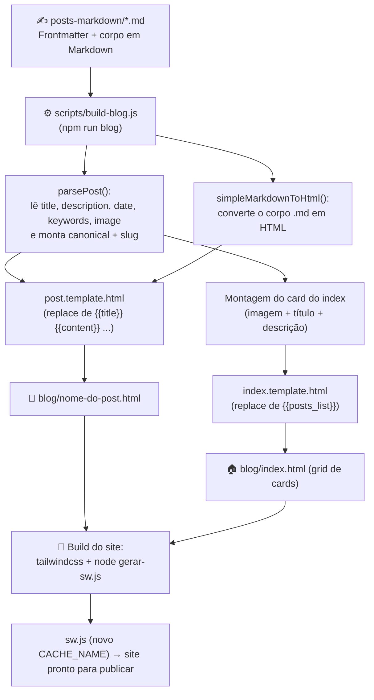
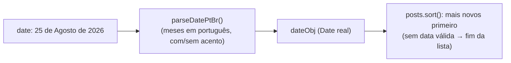

# 📝 Catálogo do Blog de Enfermagem

**Projeto:** Calculadoras de Enfermagem
**Gerado em:** 25/08/2026
**Escopo:** Documentação completa do sistema que gera o Blog de Enfermagem (Markdown → HTML)

---

## 1. Visão Geral

O Blog de Enfermagem é gerado por um **conversor próprio em Node.js**. Você **não escreve HTML**:
escreve artigos em **Markdown** na pasta `posts-markdown/` e roda um comando no terminal que transforma
tudo em HTML pronto (página inicial + uma página por artigo).

| Pergunta | Resposta |
|---|---|
| Onde escrevo o artigo? | `posts-markdown/nome-do-post.md` |
| O que gera os HTMLs? | `scripts/build-blog.js` (comando `npm run blog`) |
| Onde saem os HTMLs prontos? | `blog/` (NUNCA editar manualmente) |
| Quais templates são usados? | `blog-templates/index.template.html` e `blog-templates/post.template.html` |
| Qual a URL do blog? | `https://www.calculadorasdeenfermagem.com.br/blog/` |
| Qual a URL de um artigo? | `https://www.calculadorasdeenfermagem.com.br/blog/<slug>.html` |

> ⚠️ **Regra de ouro:** `blog/` e `blog-templates/` estão na lista de pastas PROIBIDAS de alterar sem
> autorização. Qualquer mudança deve ser feita no Markdown (fonte de verdade) ou, com autorização,
> nos templates. Editar os HTMLs gerados é inútil: eles são **sobrescritos** no próximo build.

---

## 2. Estrutura Física (pastas e arquivos do sistema)

```
raiz-do-site/
├── posts-markdown/                     ← FONTE DE VERDADE (aqui você escreve)
│   ├── atuacao_enfermeiro_na_pcr.md
│   ├── historia_do_estetoscopio.md
│   ├── interpretacao-gasometria.md
│   ├── os-bastidores-da-escala-de-braden.md
│   ├── proposito-enfermagem.md
│   ├── resolucao-cofen-dimensionamento.md
│   ├── sae-e-nanda-juntas-pela-assistencia.md
│   └── vestimenta-enfermagem.md
├── blog-templates/                     ← TEMPLATES (proibido editar sem autorização)
│   ├── index.template.html             ← molde da página inicial ({{posts_list}})
│   └── post.template.html              ← molde de cada artigo ({{title}}, {{content}}...)
├── scripts/
│   └── build-blog.js                   ← O GERADOR (executado por "npm run blog")
├── blog/                               ← SAÍDA GERADA (proibido editar manualmente)
│   ├── index.html                      ← página inicial com o grid de cards
│   └── <slug>.html                     ← uma página por artigo
├── img/                                ← imagens do site (padrão .webp)
└── package.json                        ← script: "blog": "node scripts/build-blog.js"
```

---

## 3. Fluxograma do Sistema



Fluxo da data (ordenação da página inicial):



---

## 4. Criando um Artigo do Zero (passo a passo)

1. **Prepare a imagem de capa** — coloque um `.webp` em `/img/` seguindo a convenção de nomes
   (ver seção 7). Confirme que o arquivo existe antes de referenciar.
2. **Crie o arquivo** `posts-markdown/nome-do-post.md`.
   - O nome do arquivo vira a URL: `blog/nome-do-post.html`. Use minúsculas, sem acentos, com hífens.
3. **Escreva o cabeçalho (frontmatter)** — ver seção 5.
4. **Escreva o corpo em Markdown** — ver seção 6.
5. **Gere os HTMLs**: `npm run blog`
6. **Confira o resultado**: abra `blog/nome-do-post.html` e `blog/index.html`.
7. **Rode o build obrigatório do site** (regra geral do projeto):
   ```
   .\node_modules\.bin\tailwindcss -i ./src/input.css -o ./public/output.css --minify
   node gerar-sw.js
   ```
8. **Publique** — commit/push são responsabilidade do desenvolvedor (nunca executar automaticamente).

---

## 5. O Cabeçalho (Frontmatter) — como deve ser escrito

Todo artigo começa com um bloco entre `---` (obrigatório). Os campos são lidos linha a linha
pelo `parsePost()`.

```markdown
---
title: A Importância da SAE e da NANDA na Prática do Enfermeiro
description: Entenda como a SAE e a classificação NANDA contribuem para uma assistência mais segura.
date: 23 de Julho de 2026
keywords: SAE, NANDA, enfermagem, diagnóstico de enfermagem, processo de enfermagem
image: /img/livronanda-calculadoras-de-enfermagem.webp
---

Aqui começa o conteúdo do artigo...
```

### 5.1 Tabela de campos

| Campo | Obrigatório? | Onde aparece | Regras |
|---|---|---|---|
| `title:` | Sim | Título do card, H1 do hero, `<title>`, OG, Schema.org | Texto livre |
| `description:` | Sim | Texto do card (2 linhas), meta description, OG | Curta (~155 caracteres) |
| `date:` | Sim | Eyebrow do hero, `article:published_time`, Schema.org | Formato pt-BR: `D de Mês de AAAA` (meses em português, com ou sem acento) |
| `keywords:` | Sim | meta keywords, Schema.org | Separadas por vírgula |
| `image:` | Sim | Thumb do card, og:image, twitter:image, Schema.org | Ver regras da seção 7 |

### 5.2 Como o `image:` é transformado em URL

O `build-blog.js` converte o valor automaticamente:

| O que você escreve | URL final usada |
|---|---|
| `/img/exemplo.webp` | `https://www.calculadorasdeenfermagem.com.br/img/exemplo.webp` |
| `img/exemplo.webp` (sem `/`) | `https://www.calculadorasdeenfermagem.com.br/img/exemplo.webp` |
| `https://...` (URL completa) | mantida como está |

Valores padrão (se o campo faltar): título "Sem Título", descrição "Descrição indisponível.",
data "Data não informada", keywords "enfermagem", imagem `iconpages.webp`.

### 5.3 Data — regras rígidas

- Formato aceito: `25 de Agosto de 2026` (dia + "de" + mês em português + "de" + ano).
- Acentos não importam (o parser normaliza ç→c, ã→a, é→e etc.).
- A data ordena a página inicial: **mais novos aparecem primeiro**. Sem data válida, o post vai para o final.

---

## 6. Sintaxe Markdown Suportada (o que o conversor entende)

O conversor é o `simpleMarkdownToHtml()` e aplica as regras **nesta ordem** (a ordem importa:
imagens são convertidas antes dos links). Não é um Markdown completo — use apenas o que está aqui.

| O que escrever | Resultado | Como fica no HTML |
|---|---|---|
| `# Título` | H1 azul-escuro | `<h1 class="text-3xl font-black text-[#1A3E74] mb-6">` |
| `## Subtítulo` | H2 azul-escuro com linha inferior | `<h2 class="text-2xl md:text-3xl font-bold text-[#1A3E74] mt-12 mb-6 border-b pb-3">` |
| `### Sub-subtítulo` | H3 azul-claro | `<h3 class="text-xl md:text-2xl font-bold text-[#4A90E2] mt-10 mb-4">` |
| `**texto em negrito**` | **Negrito** azul-escuro | `<strong>` (estilo `.prose strong` = cor #1A3E74) |
| `` | Imagem em largura total | `` |
| `[texto do link](/pagina.html)` | Link azul em negrito | `<a ... class="text-[#4A90E2] font-bold hover:underline hover:text-[#1A3E74]">` |
| `* item da lista` (início de linha) | Item de lista com marcador | `<ul class="list-disc ml-6 mb-8 text-slate-700">` + `<li class="mb-3 text-lg">` |
| linha em branco entre parágrafos | Quebra de parágrafo | `\n\n` vira `</p><p class="mb-6 text-base md:text-lg text-justify leading-8">` |

### 6.1 Exemplo de corpo completo

```markdown
# A Importância da SAE

A **Sistematização da Assistência de Enfermagem** organiza o cuidado e garante
segurança ao paciente.


## O Papel da NANDA

A NANDA padroniza os diagnósticos. Veja os pontos principais:

* Diagnóstico claro e objetivo
* Plano de cuidados individualizado
* Acompanhamento da evolução clínica

Acesse a [Calculadora da Escala de Braden](/braden.html) para saber mais.
```

### 6.2 O que NÃO é suportado (evite)

- ❌ Itálico `*texto*` ou `_texto_` (asteriscos no meio do texto ficam literais)
- ❌ Tabelas em Markdown
- ❌ Listas numeradas `1. item`
- ❌ Citações `>` e blocos de código
- ❌ Legendas de imagem (figcaption)
- ⚠️ Parágrafos só quebram com **linha em branco** entre eles (`\n\n`)

---

## 7. Imagens — Regras Rígidas (lição do incidente de 25/08/2026)

As imagens foram o maior problema já ocorrido no blog (7 de 8 cards quebrados). Siga à risca:

1. **Usar sempre barra normal `/`** — NUNCA `\` (barra invertida quebra a URL).
2. **O arquivo precisa existir de verdade.** Os nomes reais na pasta `/img/` seguem a convenção
   `assunto-calculadoras-de-enfermagem.webp`. Antes de referenciar, confira o nome exato.
3. **Formato recomendado:** `.webp` na pasta `/img/`.
4. **Imagem na raiz:** se o arquivo estiver na raiz do site (fora de `/img/`), o caminho é
   `/nome-da-imagem.webp` (sem `/img/`).
5. **Capas** (campo `image:` do frontmatter) viram a thumb quadrada do card e as metas OG/Twitter.
6. **Imagens do corpo** usam `` e são copiadas como estão para o HTML.
7. Texto alternativo (`alt`) é obrigatório (SEO + acessibilidade) — descreva a imagem.

### 7.1 Checklist antes de publicar um post

- [ ] Nome da imagem no `.md` é IDÊNTICO ao arquivo em `/img/` (incluindo o sufixo)?
- [ ] Caminho usa `/` (nunca `\`)?
- [ ] O arquivo existe (Test-Path)?
- [ ] Card do index e imagem do artigo carregam após `npm run blog`?

---

## 8. Os Templates (blog-templates/)

### 8.1 `post.template.html` — molde de cada artigo

Placeholders substituídos pelo build (`.replace(/{{x}}/g, valor)`):

| Placeholder | De onde vem |
|---|---|
| `{{title}}` | `title:` do frontmatter |
| `{{description}}` | `description:` |
| `{{date}}` | `date:` |
| `{{keywords}}` | `keywords:` |
| `{{image}}` | `image:` (já convertida em URL absoluta) |
| `{{canonical}}` | `https://www.calculadorasdeenfermagem.com.br/blog/<slug>.html` |
| `{{content}}` | corpo do `.md` convertido pelo `simpleMarkdownToHtml()` |

Estrutura fixa do template (não muda de artigo para artigo):

- **Head:** `<title>{{title}} – Blog Calculadoras de Enfermagem</title>`, meta description/keywords,
  robots `index, follow`, Open Graph (`og:type article`, `og:image {{image}}`), Twitter Card
  `summary_large_image`, canonical + hreflang pt-br/x-default, favicon, fontes críticas,
  CSS do site, **Schema.org `Article`** (headline, image, keywords, `datePublished {{date}}`,
  autor Organization, `mainEntityOfPage`), anti-CLS, `global-scripts.js` com `defer`.
- **Body:**
  1. Menu global (`#global-header-container`)
  2. `<main>` com hero azul (#1A3E74): eyebrow com a data `{{date}}` → **H1 `{{title}}`** → eyebrow
     "Conteúdo para enfermagem"
  3. `<article class="prose max-w-none">{{content}}</article>` — onde o conteúdo entra
  4. Widget "Dúvidas Frequentes" com link para o fórum
  5. Footer carregado via `fetch("/footer.html")` + `carregarTraducoes('pt', 'footer.json')` e `cookies.json`

### 8.2 `index.template.html` — molde da página inicial

- Placeholder único: `{{posts_list}}` (substituído pelos cards de TODOS os posts, já ordenados).
- Head fixo: title "Blog da Enfermagem - Biblioteca Visual", canonical/hreflang para
  `/blog/index.html`, Open Graph `website`, fontes, CSS, bloco de consentimento/Analytics/AdSense.
- Body: menu global → hero "Blog de Enfermagem" (H1 + eyebrow "Biblioteca Assuntos Relacionados
  a Enfermagem") → **grid responsivo** (`grid-cols-1 sm:2 md:3 lg:4 xl:5`) com `{{posts_list}}` → footer.

### 8.3 O card gerado para cada post (trecho que o build injeta)

```html
<a href="{slug}" class="group flex flex-col items-center text-center p-4 hover:bg-slate-50 rounded-xl transition-all duration-200 border border-transparent hover:border-slate-200">
  <div class="w-full aspect-square mb-3 overflow-hidden rounded-xl bg-slate-100 shadow-sm group-hover:shadow-md transition-all">
    
  </div>
  <h3 class="text-sm font-bold text-[#1A3E74] leading-tight mb-1 group-hover:text-[#4A90E2] transition-colors">
    {title}
  </h3>
  <p class="text-xs text-slate-500 line-clamp-2">
    {description}
  </p>
</a>
```

---

## 9. O Gerador (`scripts/build-blog.js`) — comportamento detalhado

1. **Configuração:** caminhos (`posts-markdown`, templates, `blog/`) e URLs
   (`domain = https://www.calculadorasdeenfermagem.com.br`,
   `baseUrl = https://www.calculadorasdeenfermagem.com.br/blog/`). Cria `blog/` se não existir.
2. **`parsePost()`** — lê o `.md`, extrai o frontmatter campo a campo, define
   `slug` (nome do arquivo trocando `.md` por `.html`), monta `canonical` e guarda `dateObj`
   (data real via `parseDatePtBr`).
3. **`parseDatePtBr()`** — converte "20 de Fevereiro de 2026" em `Date` (aceita acentos;
   fallback para `new Date()`).
4. **Ordenação** — posts por data **descendente** (mais novos primeiro); sem data válida → fim.
5. **`simpleMarkdownToHtml()`** — converte o corpo (ordem: títulos → imagens → links → listas →
   negrito → parágrafos → agrupamento de `<ul>`).
6. **Geração dos artigos** — aplica os 7 replaces no `post.template.html` e grava `blog/<slug>.html`.
7. **Geração da página inicial** — acumula os cards em `postsListHtml`, substitui `{{posts_list}}`
   no `index.template.html` e grava `blog/index.html`.
8. **Logs de sucesso:** `✅ Gerado: <slug>.html`, `✅ Índice atualizado: blog/index.html`.

---

## 10. Comandos de Terminal

| Ação | Comando | Quando usar |
|---|---|---|
| Gerar o blog | `npm run blog` | Sempre que criar/editar/excluir um `.md` em `posts-markdown/` |
| Build do site (CSS) | `.\node_modules\.bin\tailwindcss -i ./src/input.css -o ./public/output.css --minify` | Obrigatório após alterar HTML/CSS/JS do site |
| Atualizar cache (service worker) | `node gerar-sw.js` | Obrigatório após alterar páginas (gera novo `CACHE_NAME` com timestamp) |
| Publicar | git commit/push — **responsabilidade do desenvolvedor** | Nunca executar automaticamente |

> 🤖 **Watchers automáticos (tasks do VS Code):** "Watch HTML Build", "Watch Sitemap",
> "Watch Images" e "Watch PDFs" monitoram a pasta e podem disparar o build sozinhos ao salvar
> arquivos (fs.watch recursivo, anti-rajada por `mtime`). Mesmo assim, rode os comandos
> manualmente para garantir.

### 10.1 Sequência padrão de trabalho

```powershell
# 1. Edite/crie posts-markdown/meu-post.md
# 2. Gere os HTMLs do blog
npm run blog
# 3. Build obrigatório do site
.\node_modules\.bin\tailwindcss -i ./src/input.css -o ./public/output.css --minify
node gerar-sw.js
```

---

## 11. Regras e Proibições (resumo do projeto aplicado ao blog)

| Regra | Detalhe |
|---|---|
| 🚫 Pastas proibidas (sem autorização) | `blog/`, `blog-templates/`, `downloads`, `biblioteca`, `node_modules`, `.git` |
| ✍️ Fonte de verdade | `posts-markdown/*.md` — toda alteração de conteúdo começa aqui |
| 🔁 HTML gerado | `blog/*.html` é sobrescrito a cada `npm run blog` — não edite |
| 🗂️ Backup antes de editar | `backups-temporarios/<arquivo>.<YYYYMMDD-HHMMSS>.bak` |
| 🚫 Commit/push automático | Nunca executar — preparar e avisar o responsável |
| 🖼️ Imagens | Barra `/` sempre; nome EXATO do arquivo; sufixo `-calculadoras-de-enfermagem`; `.webp` |
| 🧱 Build obrigatório | Tailwind + `gerar-sw.js` após alterar HTML/CSS/JS |

---

## 12. Troubleshooting (erros comuns)

| Sintoma | Causa provável | Correção |
|---|---|---|
| Thumb cinza/quebrada no card da home | Nome da imagem no `image:` não bate com o arquivo real em `/img/` | Confira o nome exato (sufixo!) e rode `npm run blog` |
| URL com barra invertida | `img\arquivo.webp` no `.md` | Trocar `\` por `/` |
| Imagem existe mas não aparece | Arquivo está na raiz e o caminho diz `/img/...` (ou vice-versa) | Ajustar caminho: raiz = `/arquivo.webp`; pasta img = `/img/arquivo.webp` |
| Post não aparece na home | `.md` fora de `posts-markdown/`, ou data inválida (vai pro fim) | Colocar o arquivo na pasta certa; conferir `date:` no formato pt-BR |
| Ordem errada na home | `date:` fora do padrão `D de Mês de AAAA` | Corrigir a data e regenerar |
| Conteúdo "colado" sem espaçamento | Falta linha em branco entre parágrafos | Separar parágrafos com `\n\n` |
| Site ao vivo continua antigo | Service worker/cache antigo ou não publicado | Rodar `node gerar-sw.js` e publicar (commit/push + deploy) |
| Texto em itálico não funciona | Conversor não suporta itálico | Usar apenas `**negrito**` |

---

## 13. Checklist Final de Publicação de um Post

- [ ] Frontmatter completo: `title`, `description`, `date` (pt-BR), `keywords`, `image`
- [ ] Imagem de capa existe em `/img/` com nome exato e `/` no caminho
- [ ] Corpo usa apenas a sintaxe suportada (seção 6)
- [ ] `npm run blog` rodou sem erros (✅ Gerado / ✅ Índice atualizado)
- [ ] Card aparece correto em `blog/index.html`
- [ ] Página do artigo (`blog/<slug>.html`) renderiza hero, conteúdo e imagens
- [ ] Build do site rodado (Tailwind + `node gerar-sw.js`)
- [ ] Alterações prontas para o responsável publicar (commit/push)
