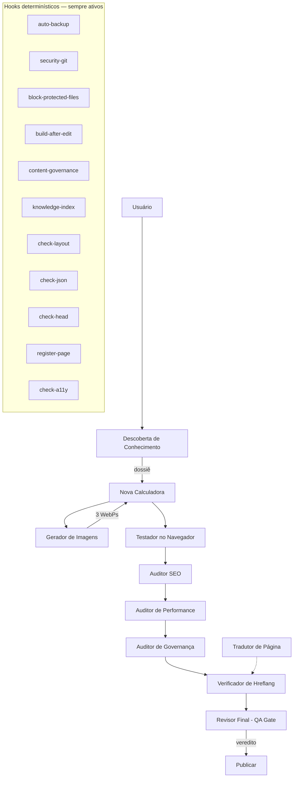

# 🗂️ Catálogo Central da Arquitetura de IA

**Projeto:** Calculadoras de Enfermagem  
**Versão da arquitetura:** V4 (ver "Versionamento" ao final)  
**Atualizado em:** 30/08/2026  
**Escopo:** agentes, hooks, skills, prompts, instruções, scripts, MCPs, integrações, componentes críticos e fluxo de orquestração.

> Este catálogo consolida a camada de IA do projeto. As regras canônicas de conteúdo
> continuam em `AI_RULES.md` (prioridade máxima), `HTML_RULES.md` e
> `HTML_PAGE_TEMPLATE_RULES.md`. Os catálogos temáticos (`CATALOGO_DOS_AGENTES.md`,
> `CATALOGO_DOS_HOOKS.md`) têm as fichas detalhadas.

---

## 📊 Resumo Geral

| Camada | Local | Qtd | Natureza |
|---|---|---|---|
| Agentes | `.github/agents/*.agent.md` | **15** | Subagentes especializados (IA) |
| Hooks | `.github/hooks/*.json` + `scripts/hooks/*.ps1` | **12** | Automações determinísticas (sem IA) |
| Skills | `.github/skills/<nome>/SKILL.md` | 3 | Conhecimento de domínio sob demanda |
| Prompts | `.github/prompts/*.prompt.md` | 5 | Comandos de barra |
| Instruções por arquivo | `.github/instructions/*.instructions.md` | 4 | Regras por extensão (`applyTo`) |
| Workflows | `.github/workflows/*.yml` | 1 | Deploy (GitHub Pages) |
| MCPs | — | **0 no repo** | nenhum `.mcp.json`; ver seção MCPs |

---

## 🤖 Agentes (15)

| # | Agente | Ferramentas | Perfil |
|---|---|---|---|
| 1 | Auditor de Governança Regulatória | read, search | Auditoria |
| 2 | Auditor SEO | read, search, web | Auditoria |
| 3 | Build do Site | execute | Execução |
| 4 | Descoberta de Conhecimento | read, search | Pesquisa |
| 5 | Gerador de Imagens | read, edit, search | Criação |
| 6 | Nova Calculadora | read, edit, search | Criação |
| 7 | Testador no Navegador | read, search, execute | Validação |
| 8 | Tradutor de Página | read, edit, search | Criação |
| 9 | Auditor de Performance (CWV) | read, search, execute | Auditoria |
| 10 | Revisor de Integridade | read, edit, search, execute | Correção |
| 11 | Verificador de Hreflang/Canonical | read, search | Auditoria |
| 12 | Revisor Final (QA Gate) | read, search | Auditoria (contra-prova) |
| 13 | Auditor do Ecossistema | read, search | Auditoria |
| 14 | Auditor de Conformidade Técnica | read, search, execute | Auditoria |
| 15 | Agente Alfandegário | read, search | Gate (processo) |

## 🪝 Hooks (12)

| # | Hook | Evento | Bloqueia? |
|---|---|---|---|
| 1 | auto-backup | PreToolUse | Não (allow) |
| 2 | security-git | PreToolUse | Sim (deny commit/push) |
| 3 | block-protected-files | PreToolUse | Sim (deny `.git`/`node_modules`; ask protegidos) |
| 4 | build-after-edit | PostToolUse | Não |
| 5 | content-governance | PostToolUse | Não |
| 6 | knowledge-index | PostToolUse | Não |
| 7 | check-layout | PostToolUse | Não (reporta) |
| 8 | check-json | PostToolUse | Não (reporta) |
| 9 | check-head | PostToolUse | Não (reporta) |
| 10 | register-page | PostToolUse | Não (reporta) |
| 11 | check-a11y | PostToolUse | Não (reporta) |
| 12 | check-conformidade | PostToolUse | Não (reporta) |

## 🧰 Scripts determinísticos principais (sem IA)

- `generate-sitemap.js` (sitemap) · `gerar-sw.js` (service worker) · `build.js` (Tailwind)
- `scripts/build-knowledge-index.js` / `knowledge-discover.js` (base de conhecimento)
- `scripts/validate-content-governance.js` (governança) · `scripts/auditar-cwv.js` / `corrigir-cwv.js` (CWV)
- `scripts/fix-broken-links.js` (integridade de links) · `scripts/validate_new_page.js`
- `scripts/build-biblioteca.js` / `build-downloads.js` / `build-blog.js` / `build-nanda.js`

---

## 🔌 MCPs e Integrações (avaliação)

- **MCPs:** não há `.mcp.json` no repositório. Os MCPs disponíveis no ambiente do editor
  (Pylance, notebook, servidores GCP) são externos ao projeto. **Decisão:** manter sem MCP
  próprio enquanto as ferramentas nativas (PowerShell, Node, agentes) cobrirem as tarefas;
  avaliar MCP apenas se surgir integração que exija protocolo (ex.: GitHub/Firebase via MCP).
- **GitHub Pages (deploy):** `.github/workflows/deploy.yml` (gera sitemap + SW + upload).
- **Firebase (login):** Fases 1–5 concluídas (`js/firebase/`, `js/auth/`); Fase 6 planejada.
  `firestore.rules` com regras por coleção (PENDENTE aplicar no Console).
- **Supabase:** `@supabase/supabase-js` referenciado em 4 páginas; uso pontual.
- **Cloudflare / Google Cloud:** sem integração ativa; avaliar somente sob necessidade.

---

## 🔒 Classificação de criticidade (§15)

| Nível | Componentes | Regra de alteração |
|---|---|---|
| **NÍVEL 1 — CRÍTICO** | `AI_RULES.md`, `HTML_RULES.md`, `HTML_PAGE_TEMPLATE_RULES.md`, `copilot-instructions.md`, `firestore.rules`, módulos `js/auth/` e `js/firebase/`, `sw-template.js`/`gerar-sw.js`, `deploy.yml`, componentes globais (`footer.html`, `menu-global.html`, `global-body-elements.html`), hooks `security-git` e `block-protected-files` | **AGORA IMPOSTO** por hook `deny` (regras canônicas, MCP, segredos, login/deploy/SW) — não depende mais da memória do agente. |
| **NÍVEL 2 — IMPORTANTE** | Catálogos canônicos, hooks de build/validação, `banco_nanda*.json`/`banco_nic_*.json`, `/knowledge/*.json`, `governance/*` | Exige backup + teste antes de alterar. |
| **NÍVEL 3 — NORMAL** | Páginas HTML individuais, scripts utilitários | Backup automático (hook) + build obrigatório. |
| **NÍVEL 4 — AUXILIAR** | `backups-temporarios/`, `reports/`, `logs/` | Sem restrição (descartáveis). |

---

## 🎯 Orquestração e pipeline (§8)

O agente principal atua como orquestrador: identifica a tarefa, seleciona o agente e a
ferramenta, e decide a sequência. O fluxo canônico de criação de página é:

## ✅ Prova e Contra-Prova (§11)

- **Prova:** o agente executor (ex.: `Nova Calculadora`) cria a página.
- **Contra-prova:** auditores independentes verificam — `Auditor SEO`, `Auditor de
  Performance`, `Auditor de Governança Regulatória`, `Verificador de Hreflang`, a skill
  `auditar-acessibilidade` e o `Testador no Navegador`.
- **Gate final:** o `Revisor Final (QA Gate)` consolida e emite PUBLICAR / PUBLICAR COM
  RESSALVAS / NÃO PUBLICAR. Ele **não** é o autor da página (independência).

## 📡 Comunicação entre IAs (§10)

Comunicação é **sob demanda e finita** (nunca em loop contínuo), acionada pelo usuário ou
pelo fluxo de orquestração: IA A executa → IA B audita → IA A corrige → IA B contra-audita
→ Revisor Final valida. Proteção contra loop: o `Revisor Final` encerra o ciclo com veredito
definitivo e nenhum agente aciona outro automaticamente sem decisão do orquestrador.

---

## 📚 Bibliotecas de erros e soluções (§13, §14)

- **Erros:** `/memories/repo/acervo-erros.json` (memória operacional; registrar ID, causa,
  correção, arquivos, tags). Consultar ANTES de investigar problemas novos.
- **Soluções:** `/memories/repo/acervo-solucoes.json` (procedimentos que funcionaram).
  Consultar ANTES de pesquisar fora.

## 💰 Controle de chamadas e custo (§27–29, §41–43)

- **Tarefa determinística → script/hook** (nunca gastar IA): renomear arquivos, validar
  JSON/layout/head/a11y, backup, build, índice, bloqueio de git/arquivos.
- **Classificação de tarefas:** A determinística (script) · B semideterminística ·
  C raciocínio (agente) · D especialista (agente) · E auditoria (auditor) · F contra-prova (QA gate).
- **Contexto mínimo:** consultar catálogos, acervos de erros/soluções e a base `/knowledge/`
  antes de buscar fora. Não enviar o projeto inteiro à IA.

---

## 🧭 Versionamento da arquitetura (§47)

| Versão | Descrição |
|---|---|
| **V1** | Original: regras canônicas (`AI_RULES.md` + `HTML_RULES.md` + `HTML_PAGE_TEMPLATE_RULES.md`) e catálogos de identidade visual / estrutura / SEO. |
| **V2** | Especialização: 8 agentes + 5 hooks + 3 skills + 5 prompts + instruções por extensão. |
| **V3** | Governança editorial + base de conhecimento `/knowledge/` + sistema de contas Firebase (Fases 1–5). |
| **V4** | Auditoria e orquestração: hooks de garantia (proteção de arquivos, layout, JSON, head, a11y, registro de página) + agentes de auditoria/correção (Performance, Integridade, Hreflang, QA Gate). |

---

## 🕳️ Lacunas restantes (e decisões de não-criação)

| Item | Decisão | Justificativa |
|---|---|---|
| Agente Auditor de Acessibilidade | **Não criado** | Skill `auditar-acessibilidade` + `Auditor SEO` já cobrem; criar duplicaria. |
| Hook `check-links` (verificação incremental de links) | **Não criado** | `Revisor de Integridade` + `fix-broken-links.js` + `MAPA_DE_DEPENDENCIAS.md` cobrem; varredura por edição seria cara e redundante. |
| Hook `generate-sitemap` automático | **Não criado** | `deploy.yml` gera o sitemap a cada deploy; regenerar a cada edição é redundante. |
| Agente Gerador de Sitemap | **Não criado** | Prompt `/gerar-sitemap` + `generate-sitemap.js` cobrem; agente seria wrapper fino. |
| Agente Curador da Base de Conhecimento | **Futuro opcional** | Base `/knowledge/` é auto-gerada; curadoria manual só se houver demanda real. |
| Catalogação de vídeos (§19) | **Pendente** | Não há `videos.json`; o acervo de vídeos é pequeno. Criar catálogo quando houver vídeos a gerenciar. |
| Integrações Cloudflare/Google Cloud (§33) | **Avaliar sob demanda** | Sem necessidade atual comprovada. |

## 🛡️ Segurança (§53–54)

- **Menor privilégio:** auditores só leem; quem edita tem `edit` restrito; `execute` só em
  agentes que precisam rodar scripts. Nenhum agente tem permissão irrestrita.
- **Não destruição:** nada é apagado sem identificar → analisar → documentar → testar →
  classificar → decidir. Backups automáticos antes de toda edição.
- **Nunca** `git commit`/`git push` por agente (bloqueado por hook `security-git`).
- **Comandos destrutivos** (`rm -rf`, `git reset --hard`, `Remove-Item -Recurse/-Force`,
  `gcloud storage rm`, `gcloud projects delete`) bloqueados; **instalações** (`npm/pip install`)
  exigem autorização — impostos pelo hook `security-git` estendido.
- **Segredos** (`.env`, `.pem`, `.key`, `.p12`, credenciais) e **componentes críticos**
  (regras canônicas, MCP, login/deploy/SW) bloqueados pelo hook `block-protected-files`.

## 📚 Catálogos complementares (FASE 49–50)

Catálogos dedicados em `CATALOGO_DOS_AGENTES_E_HOOKS/`:
`CATALOGO_DAS_SKILLS.md` · `CATALOGO_DOS_PROMPTS.md` · `CATALOGO_DAS_INSTRUCTIONS.md` ·
`CATALOGO_DOS_MCP.md` · `CATALOGO_DA_BASE_DE_CONHECIMENTO.md` · `CATALOGO_DE_TEMPLATES.md` ·
`CATALOGO_DE_IMAGENS.md` · `CATALOGO_DE_ERROS.md` · `CATALOGO_DE_SOLUCOES.md` ·
`CATALOGO_DE_AUDITORIAS.md` · `MAPA_DE_RESPONSABILIDADES.md`.

Consistência (FASE 50): o `Auditor do Ecossistema` verifica catálogo × arquivos reais
(item catalogado sem arquivo, ou arquivo sem catalogar).

**Conformidade de criação (evidência):** `registro-conformidade.json` registra, para cada
componente novo, necessidade, justificativa, verificação de duplicação, teste e catálogo.
O hook `check-conformidade` reporta como **NÃO CONFORME** qualquer componente novo sem registro.

## 🧠 Memória operacional e contexto (FASE 22–25)

- **Taxonomia de memória (FASE 22):** REGRA CANÔNICA × PADRÃO COMPROVADO × PROCEDIMENTO
  COMPROVADO × ERRO CONHECIDO × SOLUÇÃO CONHECIDA × CONHECIMENTO DE DOMÍNIO × CONTEXTO DE
  TAREFA × INFORMAÇÃO TEMPORÁRIA. Não misturar regra com recomendação.
- **Contexto em camadas (FASE 23):** índice mínimo → metadados → trechos relevantes →
  arquivo completo → conjunto completo (só em auditoria especial).
- **Observabilidade (FASE 24–25):** registrar agente, motivo, arquivos, ferramentas,
  resultado e retry; marcar se poderia ser hook/script/índice. Estratégia documentada —
  implementação depende de métricas de tokens não expostas pela plataforma hoje.
- **Conteúdo social (FASE 26):** AVALIADO — não criar agente agora; quando necessário, gerar
  a partir da base existente (página → conteúdo social), sem recorrer ao repositório inteiro.

---
*Catálogo Central da Arquitetura — V4*
