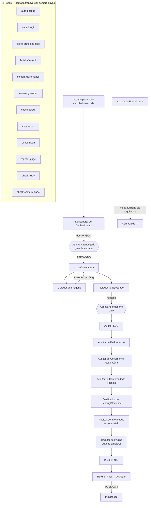

# 🔄 Fluxo de Complementaridade — Agentes e Hooks

**Projeto:** Calculadoras de Enfermagem  
**Pergunta central:** como os **15 agentes** e os **12 hooks** se complementam e em que ordem entram?

> **Fonte canônica:** `CATALOGO_CENTRAL_DA_ARQUITETURA.md` contém o inventário oficial,
> a criticidade, o versionamento e as decisões. Este documento detalha o **fluxo**.

## 🎯 Princípio

- **Hooks** atuam **por baixo**, de forma invisível e automática, em todo o ciclo
  (camada transversal).
- **Agentes** atuam **por cima**, sob demanda, cada um em uma etapa específica.
- **Agente Alfandegário** = gate de processo (entrada/saída entre etapas).
- **Auditor do Ecossistema** = meta-auditoria da própria arquitetura.
- Juntos: os hooks **garantem** (backup, build, governança, índice, bloqueio) e os
  agentes **decidem** (pesquisar, criar, gerar imagens, testar, auditar, traduzir).

## 🧩 Pipeline completo de criação de uma página nova



## 🕐 Quando cada um inicia (gatilho)

| Elemento | Tipo | Inicia quando |
|---|---|---|
| `auto-backup` | Hook (Pre) | Antes de `create_file` / `replace_string_in_file` / `multi_replace_string_in_file` / `edit_notebook_file` |
| `security-git` | Hook (Pre) | Antes de `run_in_terminal` (bloqueia `git commit/push` e destrutivos) |
| `block-protected-files` | Hook (Pre) | Antes de edição (deny `.git`/`node_modules`/críticos; ask protegidos) |
| `build-after-edit` | Hook (Post) | Depois de editar `.html`/`.js`/`.css` |
| `content-governance` | Hook (Post) | Depois de editar `.html`/`.md` |
| `knowledge-index` | Hook (Post) | Depois de editar `.html` da raiz |
| `check-layout` | Hook (Post) | Depois de editar `.html` (largura/hero) |
| `check-json` | Hook (Post) | Depois de editar `.json` |
| `check-head` | Hook (Post) | Depois de editar `.html` (elementos do head) |
| `register-page` | Hook (Post) | Depois de criar `.html` na raiz (lembra `relatorio_paginas.txt`) |
| `check-a11y` | Hook (Post) | Depois de editar `.html` (lang/skip-link/h1/alt) |
| `check-conformidade` | Hook (Post) | Depois de criar componente novo (sem registro = NÃO CONFORME) |
| Descoberta de Conhecimento | Agente | Antes de criar/atualizar página |
| Agente Alfandegário | Agente (gate) | Entre etapas (pré-condições e evidências) |
| Nova Calculadora | Agente | Pedido de nova ferramenta |
| Gerador de Imagens | Agente | Após estruturação do conteúdo |
| Testador no Navegador | Agente | Após criação/edição |
| Auditor SEO | Agente | Antes de publicar |
| Auditor de Performance | Agente | Antes de publicar (CWV) |
| Auditor de Governança | Agente | Quando há conteúdo regulatório/normativo |
| Auditor de Conformidade Técnica | Agente | Antes de publicar (CWV+mobile+a11y consolidado) |
| Verificador de Hreflang | Agente | Quando há dúvida de cluster multilingue |
| Revisor de Integridade | Agente | Quando há links/imagens quebrados |
| Tradutor de Página | Agente | Pedido de tradução |
| Build do Site | Agente | Quando o build precisa ser forçado |
| Revisor Final (QA Gate) | Agente (gate) | Fim do pipeline (veredito) |
| Auditor do Ecossistema | Agente (meta) | Quando se audita a própria arquitetura |

## 🔗 Pares de complementaridade

| Agente | Hook/script relacionado | Como se complementam |
|---|---|---|
| Nova Calculadora | `auto-backup` + `build-after-edit` | O agente cria; o hook faz backup antes e build depois |
| Nova Calculadora | `content-governance` | O agente insere os marcadores; o hook valida |
| Nova Calculadora | `knowledge-index` | O agente cria o HTML da raiz; o hook reindexa `/knowledge/` |
| Descoberta de Conhecimento | `knowledge-index` / `knowledge-discover.js` | O hook mantém o índice; o agente o consulta |
| Auditor de Governança | `content-governance` | O agente audita qualidade; o hook fiscaliza marcadores |
| Auditor de Performance | `auditar-cwv.js` | O agente interpreta; o script mede (0 IA) |
| Auditor de Conformidade Técnica | `auditar-cwv.js` + `check-layout`/`check-head`/`check-a11y` | O agente consolida; os scripts/hooks medem |
| Revisor de Integridade | `fix-broken-links.js` | O agente corrige; o script localiza |
| Tradutor de Página | `auto-backup` + `build-after-edit` | O agente traduz; o hook faz backup e build |
| Build do Site | `build-after-edit` | O agente roda build manual; o hook roda automático |
| Auditor do Ecossistema | `auditar-ecossistema.js` | O script audita (0 IA); o agente interpreta semanticamente |

## 🔁 Ciclo de vida resumido

```
[Pedido] → Descoberta → (gate Alfandegário) → Criação → Imagens → Teste →
(gate Alfandegário) → SEO → Performance → Governança → Conformidade Técnica →
Hreflang → Integridade → Tradução → Build → Revisor Final → Publicação
        ▲                                                                            ▲
        └─ hooks transversais: auto-backup, security-git, block-protected-files ─────┘
        └─ hooks pós-edição: build-after-edit, content-governance, knowledge-index,
           check-layout, check-json, check-head, register-page, check-a11y,
           check-conformidade
```

**Observações:**

- `security-git` e `block-protected-files` são **transversais** — valem para qualquer
  etapa, bloqueando commit/push e arquivos críticos o tempo todo.
- `Auditor do Ecossistema` roda **fora do pipeline de conteúdo** — audita a própria
  arquitetura (agentes, hooks, catálogos, duplicidades, órfãos).
- O `Agente Alfandegário` é **gate de processo** (entrada/saída de etapa), e não um
  executor de conteúdo — diferente do `Revisor Final`, que emite o veredito da página.
