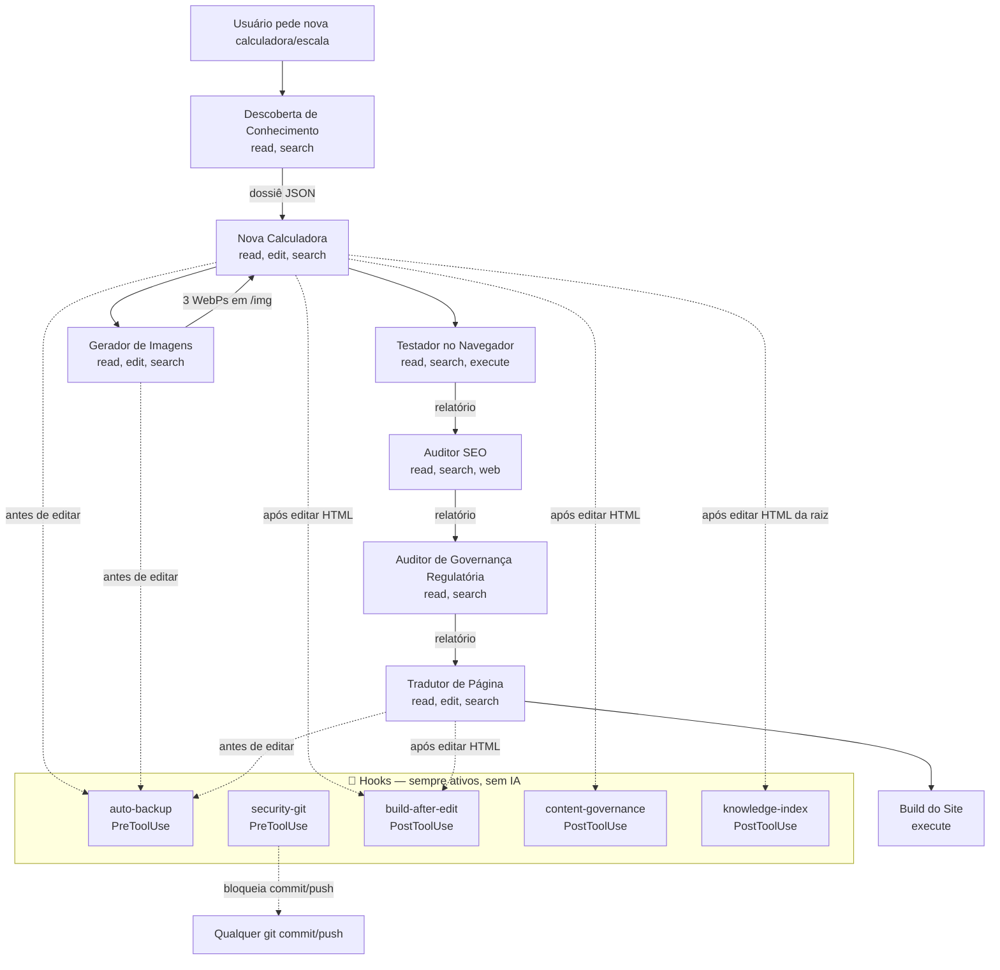

# 🔄 Fluxo de Complementaridade — Agentes e Hooks

**Projeto:** Calculadoras de Enfermagem  
**Pergunta central:** como os 8 agentes e os 5 hooks se complementam e em que ordem entram?

## 🎯 Princípio

- **Hooks** atuam **por baixo**, de forma invisível e automática, em todo o ciclo.
- **Agentes** atuam **por cima**, sob demanda, cada um em uma etapa específica.
- Juntos: os hooks **garantem** (backup, build, governança, índice, bloqueio de git) e
  os agentes **decidem** (pesquisar, criar, gerar imagens, testar, auditar, traduzir).

## 🧩 Pipeline completo de criação de uma página nova



## 🕐 Quando cada um inicia (gatilho)

| Elemento | Tipo | Inicia quando |
|---|---|---|
| `auto-backup` | Hook (Pre) | Antes de `create_file` / `replace_string_in_file` / `multi_replace_string_in_file` / `edit_notebook_file` |
| `security-git` | Hook (Pre) | Antes de `run_in_terminal` (se comando for `git commit`/`push`) |
| `build-after-edit` | Hook (Post) | Depois de editar `.html`/`.js`/`.css` |
| `content-governance` | Hook (Post) | Depois de editar `.html`/`.md` |
| `knowledge-index` | Hook (Post) | Depois de editar `.html` da raiz |
| Descoberta de Conhecimento | Agente | Antes de criar/atualizar página |
| Nova Calculadora | Agente | Pedido de nova ferramenta |
| Gerador de Imagens | Agente | Após estruturação do conteúdo |
| Testador no Navegador | Agente | Após criação/edição |
| Auditor SEO | Agente | Antes de publicar |
| Auditor de Governança | Agente | Quando há conteúdo regulatório/normativo |
| Tradutor de Página | Agente | Pedido de tradução |
| Build do Site | Agente | Quando o build precisa ser forçado |

## 🔗 Pares de complementaridade

| Agente | Hook relacionado | Como se complementam |
|---|---|---|
| Nova Calculadora | `auto-backup` + `build-after-edit` | O agente cria; o hook faz backup antes e build depois |
| Nova Calculadora | `content-governance` | O agente insere os marcadores; o hook valida |
| Nova Calculadora | `knowledge-index` | O agente cria o HTML da raiz; o hook reindexa `/knowledge/` |
| Descoberta de Conhecimento | `knowledge-index` | O hook mantém o índice; o agente o consulta |
| Auditor de Governança | `content-governance` | O agente audita qualidade; o hook fiscaliza presença dos marcadores |
| Auditor SEO | `build-after-edit` | O agente reporta CLS/CWV; o hook mantém o SW/cache atualizado |
| Tradutor de Página | `auto-backup` + `build-after-edit` | O agente traduz; o hook faz backup e build |
| Build do Site | `build-after-edit` | O agente roda build manual; o hook roda build automático |

## 🔁 Ciclo de vida resumido

```
[Pedido] → Descoberta → Criação → Imagens → Teste → SEO → Governança → Tradução → Build
                ▲                                          ▲
                └── hooks: auto-backup (antes),            └── hooks: content-governance,
                    build-after-edit, knowledge-index          build-after-edit (depois)
```

**Observação:** o `security-git` é transversal — vale para qualquer etapa, bloqueando
commit/push o tempo todo.
